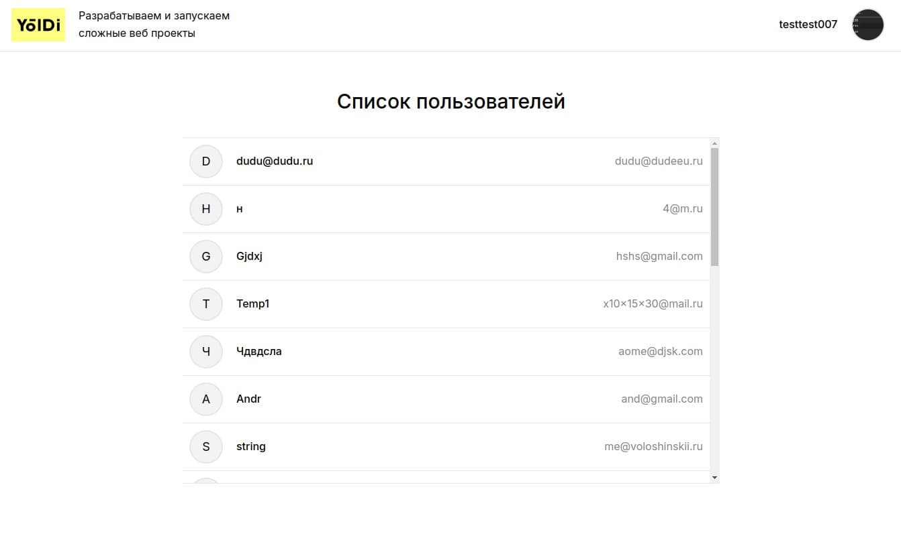
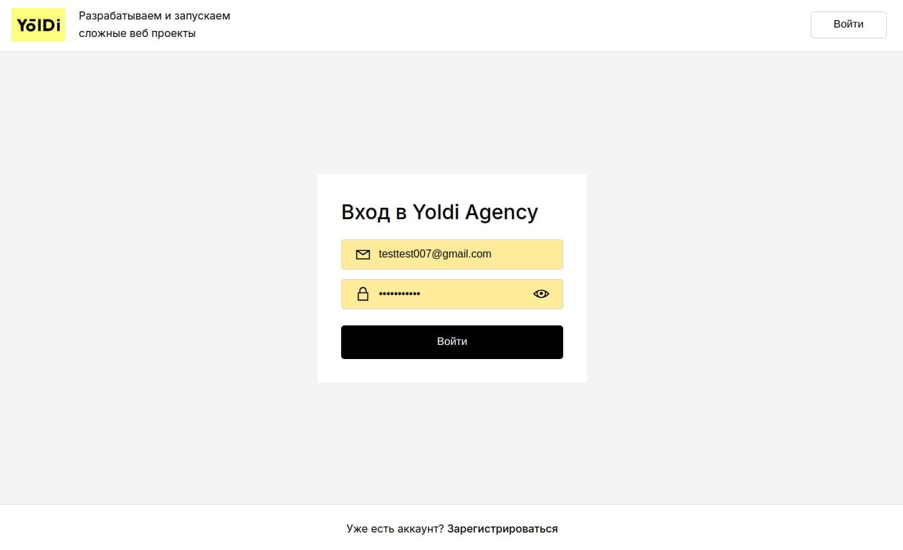
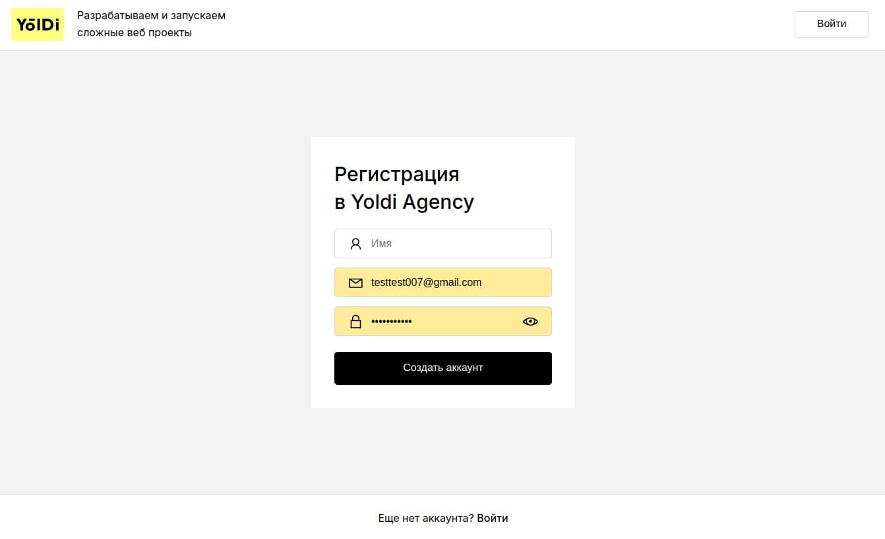
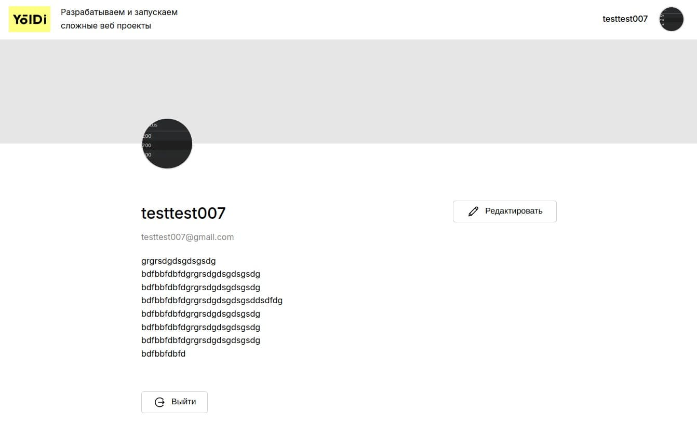
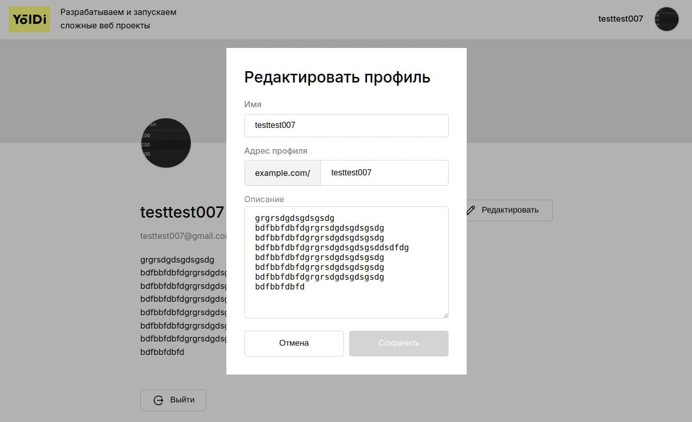

Yoldi Profile
🎬 Portfolio Overview (VIACHESLAV PUSTOVIT)

🛠️ Project description
This is a profile management application built with Next.js, featuring user profile editing, portfolio management, and integration with external services. It provides a smooth user experience, real-time updates, and secure authentication.

🚀 Functionality

- User authentication and authorization
- Managing user profiles (name, email, avatar, etc.)
- Ability to edit, update, and delete user data
- Responsive design with real-time data updates
- Integration with external services for data fetching and form validation

🧰 Technologies Used

⚛️ Next.js (with turbopack for fast development)

⚙️ TypeScript

🎨 Sass (for styling)

🧑‍💻 SWR (for data fetching)

🛠️ ESLint & Prettier (for code linting and formatting)

📦 React (core library for building UI)

⚙️ Installation and launch

Clone the repository:

```bash
git clone https://github.com/gitslava92/yoldi-profile.git
cd yoldi-profile
```

Install the dependencies:

```bash
npm install
```

```bash
npm run dev
```

Key directories

```bash
/app/ — Individual pages with dynamic routing

/features/ — Independent functionality modules

/entities/ — Core business models

/shared/ — Common utilities, UI components, and hooks

/widgets/ — Reusable UI components like modals, buttons, etc.

/process/ — Business logic for handling processes like data fetching, validation, and state
```

Project Scripts
dev: Start the development server with turbopack for fast hot-reloading
npm run dev

build: Build the project for production

```bash
npm run build
```

start: Start the production server

```bash
npm run start
```

lint: Run ESLint to check for code issues

```bash
npm run lint
```

prettier: Format the code with Prettier

```bash
npm run prettier
```

Project screenshots

main page



login page



sign up page



profile page



edit profile page



Feel free to customize this README.md as per your project needs.
